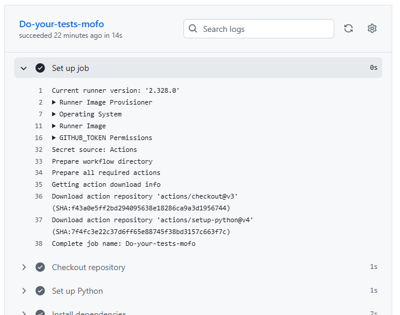

# Questions - Labo0

### Question 1
> Si l'un des tests échoue à cause d'un bug, comment pytest signale-t-il l'erreur et aide-t-il à la localiser ? Rédigez un test qui provoque volontairement une erreur, puis montrez la sortie du terminal obtenue.


Selon l'image, une section dédiée à l'erreur s'affiche, la raison de l'erreur ainsi que la ligne dans le code de test où l'erreur s'est produite.

### Question 2
> Que fait GitLab pendant les étapes de "setup" et "checkout? Veuillez inclure la sortie du terminal GitLab CI dans votre réponse.


<b>Setup</b>: provisionne une VM/Container temporaire pour y installer Python, les dépendances et les variables d'environnement.


<b>Checkout</b>: clone le dépôt dans la VM pour avoir le code sur lequel exécuter les tests.

### Question 3
> Quelle approche et quelles commandes avez-vous exécutées pour automatiser le déploiement continu de l'application dans la machine virtuelle? Veuillez inclure les sorties du terminal et les scripts bash dans votre réponse

#### Workaround
À l'heure actuelle, les VMs académiques ne fonctionnent pas. De ce fait, il est possible de contourner la situation en créant notre propre VM locale (Ubuntu avec VirtualBox). Ainsi, après avoir obtenu les informations de la VM (adresse IP et ces identifiants) et en activant le SSH dans celle-ci, il est possible de s'y connecter à partir de l'ordinateur hôte.

La commande étant 
`ssh admin@192.168.X.XX` et le mot de passe de la VM. Cela permet ainsi de simuler un serveur distant. Par la suite, on prépare la VM pour le labo0 avec les commandes suivantes:
```
# Mettre à jour
sudo apt update && sudo apt upgrade -y

# Installer Python et pip
sudo apt install python3 python3-pip python3-venv -y

# Installer Docker
sudo apt install docker.io -y
sudo systemctl enable docker
sudo systemctl start docker
```

Maintenant nous allons déployer le labo0 dans la VM via SSH:
```
# Récupérer le projet
git clone https://github.com/Orchydae/log430-a25-labo0.git
cd log430-a25-labo0

# Construire l’image Docker
docker build -t labo0-calculator . # j'ai ajouté sudo au début car ça ne marchait pas juste comme ça

# Lancer le conteneur
docker run --name calc -it labo0-calculator #la commande -it permet de rouler le conteneur en mode interatif (CLI app qui est la calculatrice en question)
```

#### Automatiser le déploiement continu à la suite du workaround(CD)
L'approche qui sera utilisée est via SSH.


???

Maintenant, dans le home de mon utilisateur (/home/admin/), j'y crée le script:
`nano ~/deploy.sh`

Et voici son contenu:
```
#!/bin/bash
set -euo pipefail

# Répertoire du projet sur la VM
APP_DIR="$HOME/log430-a25-labo0"

# Si le dossier n'existe pas, clone; sinon, pull
if [ ! -d "$APP_DIR/.git" ]; then
  git clone https://github.com/guteacher/log430-a25-labo0 "$APP_DIR"
fi

cd "$APP_DIR"
git pull --ff-only origin main

# Build & (re)start Docker
docker build -t labo0-calculator .
docker stop calc 2>/dev/null || true
docker rm   calc 2>/dev/null || true
docker run -d --name calc --restart=always labo0-calculator
```