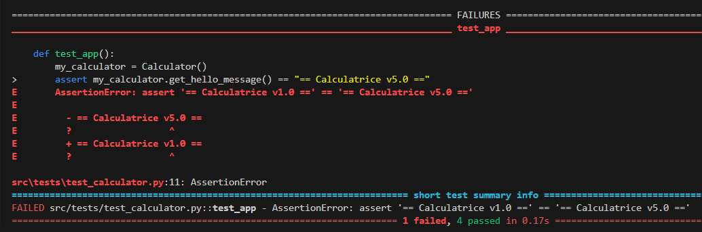

# Questions - Labo0

### Question 1
> Si l'un des tests échoue à cause d'un bug, comment pytest signale-t-il l'erreur et aide-t-il à la localiser ? Rédigez un test qui provoque volontairement une erreur, puis montrez la sortie du terminal obtenue.

Selon l'image, une section dédiée à l'erreur s'affiche, la raison de l'erreur ainsi que la ligne dans le code de test où l'erreur s'est produite.

### Question 2
> Que fait GitLab pendant les étapes de "setup" et "checkout? Veuillez inclure la sortie du terminal GitLab CI dans votre réponse.
