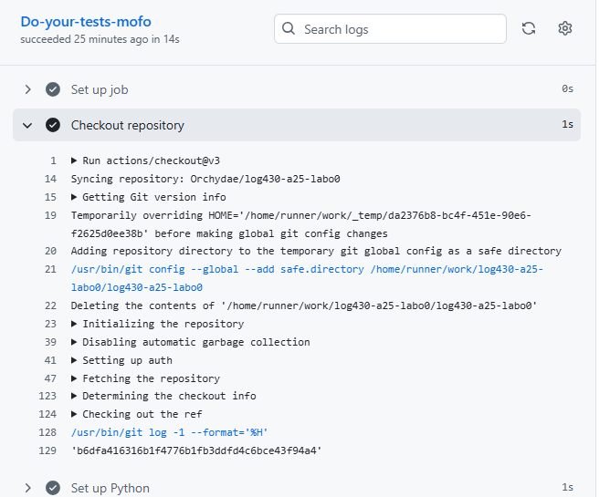

# Questions - Labo0

### Question 1
> Si l'un des tests échoue à cause d'un bug, comment pytest signale-t-il l'erreur et aide-t-il à la localiser ? Rédigez un test qui provoque volontairement une erreur, puis montrez la sortie du terminal obtenue.


Selon l'image, une section dédiée à l'erreur s'affiche, la raison de l'erreur ainsi que la ligne dans le code de test où l'erreur s'est produite.

### Question 2
> Que fait GitLab pendant les étapes de "setup" et "checkout? Veuillez inclure la sortie du terminal GitLab CI dans votre réponse.


<b>Setup</b>: provisionne une VM/Container temporaire pour y installer Python, les dépendances et les variables d'environnement.


<b>Checkout</b>: clone le dépôt dans la VM pour avoir le code sur lequel exécuter les tests.

### Question 3
> Quelle approche et quelles commandes avez-vous exécutées pour automatiser le déploiement continu de l'application dans la machine virtuelle? Veuillez inclure les sorties du terminal et les scripts bash dans votre réponse

#### Workaround
À l'heure actuelle, les VMs de l'école ne fonctionnent pas. De ce fait, il est possible de contourner la situation en créant notre propre VM - Azure VM a été choisi pour ce projet. 


Ainsi, pour que la pipeline CI/CD fonctionne avec cette VM, les secrets ont été configuré dans le repo GitHub:


Ensuite, j'ai vérifié la connectivité depuis ma machine locale:


Puis, je me suis assuré que les prérequis existent sur la VM:
```
# Git
sudo apt update
sudo apt install git -y

# Docker et Docker Compose
sudo apt install docker.io docker-compose -y
sudo usermod -aG docker azureuser
sudo systemctl enable docker
sudo systemctl start docker

# Configurer Git
git config --global user.name "Orchydae"
git config --global user.email "nguyen.dddavid@hotmail.com"
```

Enfin l'approche qui sera utilisé pour l'automatisation du déploiement est sshpass pour sa simplicité. Le script BASH utilisé est le suivant:
```
sshpass -e ssh -o StrictHostKeyChecking=no -p ${{ secrets.SSH_PORT }} \
            ${{ secrets.SSH_USER }}@${{ secrets.VM_HOST_IP }} "
            set -euo pipefail
            cd ~
            REPO_NAME=\$(basename ${{ github.repository }})
            if [ ! -d \$REPO_NAME ]; then
              git clone https://github.com/${{ github.repository }}.git
            fi;
            cd \"$REPO_NAME\"
            git fetch --all --prune
            git checkout main
            git pull --ff-only

            # Build & (re)create containers
            docker compose build --no-cache
            docker compose up -d --remove-orphans

            # Clean up unused Docker images
            docker image prune -f

            # Show running containers
            docker compose ps
          "
```

